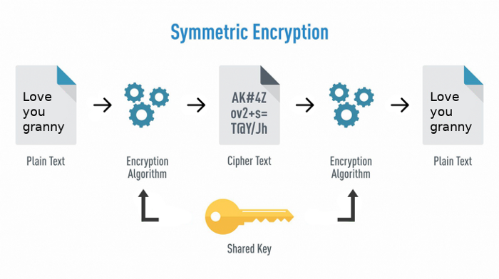
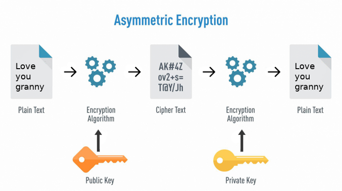

# Kriptografi Modern (RSA) ^^

## **Daftar Isi**

## Pendahuluan

Berbeda dengan kriptografi klasik seperti Caesar, Vigenere, dan algoritma kriptografi klasik lainnya yang biasanya memiliki operasi pada mode karakter, Kriptografi modern adalah kriptografi yang dalam penggunaannya beroperasi pada mode bit. Dalam kriptografi modern ini, baik *key*, *plaintext*, maupun *ciphertext* akan diproses dalam rangkaian bit alih-alih diproses sebagai karakter. Biasanya, kriptografi modern didasari pada teori-teori matematis dan memiliki ketahanan komputasional yang tinggi sehingga sulit dipecahkan oleh penyerang. Biasanya dalam kriptografi modern dibagi dua jenis dalam konteks kunci yang dipakai yaitu algoritma kunci simetris dan algoritma kunci publik.

## Algoritma Kunci Simetris

Algoritma ini menggunakan kunci yang sama pada proses enkripsi dan dekripsi. Contoh Algoritma yang termasuk algoritma kunci simetris seperti DES, Triple DES, AES, dan beberapa algoritma lainnya yang menggunakan Feistel Network.



## Algoritma Kunci Publik (Asimetris)

Seperti yang telah dijelaskan pada [Materi 1 Kriptografi](../../Pertemuan%201/Materi1-Kriptografi/Readme.md). Pada algoritma kunci publik ini, kunci yang digunakan untuk melakukan enkripsi dan dekripsi merupakan kunci yang berbeda yang terdiri dari *public key* atau kunci yang bersifat publik dan boleh disebarluaskan dan *private key* atau kunci yang rahasia. Namun, meskipun kuncinya berbeda bukan berarti antara *public key* dan *private key* tidak memiliki keterkaitan satu sama lain.



Contoh dari algoritma yang menggunakan skema kunci ini adalah RSA, Diffie-Hellman dan ECC. Karena skema kunci algoritma ini lebih mahal secara komputational, biasanya digunakan sebagai salah satu algoritma yang digunakan dalam pertukaran kunci(*key exchange*) pada algoritma kunci simetris. Pada pertemuan kali ini, kita akan membahas lebih dalam lagi di algoritma kunci publik khususnya pada algoritma RSA dan beberapa teknik kriptanalisisnya dalam CTF.

## RSA

Rivest-Shamir-Addleman atau biasa disingkat menjadi RSA merupakan algoritma pertama yang menerapkan skema kunci publik secara menyeluruh. Pada RSA, keamanan yang dimiliki berkutat pada kesulitan untuk melakukan faktorisasi bilangan komposit yang sangat besar yang bisa dikatakan merupakan "hard problem" hingga sekarang. Meskipun merupakan Hard Problem, kenapa RSA masih memiliki banyak celah? Pada kasus ini, biasanya kelemahan RSA yang ada bukanlah dikarenakan algoritmanya yang lemah tetapi dikarenakan mudahnya kesalahan dalam implementasinya.

### Bagaimana RSA bekerja

Pada dasarnya, RSA bekerja dengan memanfatkan modular exponentiaton. Modular expontiation sering digunakan dalam kriptografi dan bisa ditulis sebagai berikut.

```python
m ** e % n
```

atau

```python
pow(m, e, n)
```

Dalam algoritma RSA, dengan penggunaan modular expontiation dan faktorisasi bilangan prima memungkinkan algoritma ini bekarja dengan menciptakan *"trapdoor function"*. Fungsi *trapdoor* ini yang membuat RSA mudah untuk dihitung pada satu arah dan sulit untuk dilakukan reverse kecuali memiliki beberapa informasi yang terkait.

## Kriptanalisis pada RSA

Dalam memecahkan problem yang terkait dengan RSA ada beberapa teknik yang biasa digunakan yaitu sebagai berikut.

### Basic (Easy Factorization)

### Nth Root Attack

### Wiener Attack

### Coppersmith Attack 