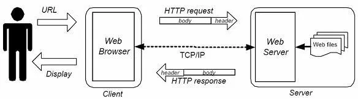

# Web Exploitation

## Cara Kerja Website
Sebelum mulai penjelasan tentang web exploitation, mungkin lebih baik kalau kita mengetahui dulu bagaimana website bekerja. Jadi website biasanya dibuat dengan dua bagian, front end dan back end. Untuk di front end, biasanya berisi HTML, CSS, JavaScript. Untuk back end bisa menggunakan bahasa pemrogramman PHP, Python, JS dan lain-lain. Alur konten website bisa kita akses bisa dilihat di gambar dibawah.



Penjelasan untuk gambar cara kerja web diatas adalah pengguna yang akan mengakses suatu website berupa URL melalui Web Browser (media untuk menuju URL yang diakses).

Selanjutnya Web Browser tersebut mengirimkan permintaan berupa HTTP request kepada Web Server melalui layer-layer TCP/IP kemudian Web Server memberikan Web files yang di-request jika ada. Web files yang telah diberikan tidak langsung ditampilkan/di-display begitu saja namun Web Server memberikan respon kembali ke Web Browser melalui HTTP response yang juga melalui layer-layer TCP/IP. Kemudian baru diterima oleh Web browser lalu dikirimkan kepada USER berupa Display.

Pada CTF, pemahaman tentang bagaimana berbagai fitur website sangat penting, karena dari tiap fitur tersebut bisa saja ada vulnerablity atau kelemahan yang bisa kita manfaatkan. Untuk penjelasan lebih lanjut mengenai bererapa kelemahan tersebut dapat dilihat [disini](https://resources.infosecinstitute.com/topic/owasp-top-10-tools-and-tactics/).

## Beberapa Info Hal yang Mungkin Berguna
Walau ada beberapa kesamaan, vulnerability pada CTF dan website pada umumnya seperti pada link diatas biasanya banyak perbedaan karena pada CTF, website memang dibuat dengan kelemahannya masing-masing. Berikut beberapa informasi tentang web yang biasanya digunakan pada CTF.
### Jenis Request
Ada beberapa request method biasanya digunakan pada suatu website, seperti GET dan POST. Untuk request method GET biasanya digunakan untuk merequest suatu data dari resource tertentu. Lalu ada POST request, yang biasanya digunakan untuk mengirimkan data ke server karena pada POST request ini kita dapat mengirimkan body pada request kita. Pada CTF bisa saja untuk mengakses suatu resource kita tidak dapat mengaksesnya langsung dari browser, yang menggunakan GET request apabila kita mencoba mengakses dari address bar, namun memerlukan request method yang lain. Ada banyak tools yang bisa digunakan, contohnya kita membuat request sendiri menggunakan python atau cURL.
### HTTP Request dan Response
Seperti yang ada pada penjelasan cara kerja website sebelumnya, pada saat kita berinteraksi dengan website kita mengirimkan HTTP request dan mendapatkan HTTP response dari website tersebut. Request yang kita kirim ke suatu website biasanya terdiri dari header dan body. Pada beberapa CTF, biasanya kita diminta untuk mengubah header dari request tersebut agar sesuai dengan permintaan soal. Ada beberapa cara untuk memanipulasi request yang kita kirim ini, misalnya dengan Burp Suite, cURL, atau extension browser kita.
### URL Encoding
Pada address bar di browser, mungkin kalian pernah melihat banyak karakter `%`. Karakter ini digunakan untuk mengencode beberapa katarkter spesial ketika kita melakukan GET Request. Biasanya payload yang kita kirimkan perlu di encode agar dapat dibaca server atau sebaliknya, untuk mengetahui suatu informasi kita perlu mendecode sesuatu dari url.
### Cookies
Cookies merupakan suatu data berukuran kecil yang dibuat oleh web server untuk menyimpan informasi mengenai user pada website tertentu. Cookies ini ditempatkan di komputer user yang sedang mengakses. Pada CTF, biasanya cookies ini digunakan untuk menyimpan informasi flag atau informasi lain yang berhubungan dengan flag. Pada kasus lain juga mungkin saja cookies ini perlu kita ubah nilainya, karena pada CTF biasanya kita memang diharuskan untuk mengubah nilai cookies ini untuk mengakses suatu bagian dari website. Salah satu cara mudah untuk mengubah cookies ini adalah dengan extension browser.

## Jenis Vulnerability yang Biasa Muncul
Salah satu vulnerability yang biasanya muncul pada soal CTF adalah injection. Jadi yang dimaksud injection disini adalah suatu hal yang kita masukkan ke website, contohnya pada HTML form. Bentuknya bisa berupa text atau file. Contoh injection ini bisa berupa code injection, sql injection, command injection, dan lain-lain.
Vulnerability lain yang biasanya juga muncul yaitu insecure direct object references, yang artinya kita bisa mengakses suatu resource tanpa ada pengamanan apapun. Contohnya mungkin kita bisa mengakses suatu file di server hanya dengan mengganti directory tujuan seperti contoh berikut. 
```
https://www.example.com/display_file.php?file.txt

https://www.example.com/display_file.php?../../../etc/passwd

```
Dari contoh url diatas, kita jadi bisa mengakses file pada server hanya dengan mentraverse pathnya. Selain itu juga bisa jadi soal dapat kita selesaikan dengan mengubah cookies, melihat network tab pada developer tools browser untuk melihat file mencurigakan, atau menscan port website untuk mencari port terbuka yang dapat kita akses.

## Tools
Ada banyak tools yang bisa kita gunakan, beberapa diantara yaitu:
### Browser
Kita gunakan untuk mengakses website challengenya, menggunakan developer tools bawaan browser, atau menginstall extension browser.
### cURL
Mengirimkan data dari atau ke server, dengan berbagai protokol seperti HTTP, HTTPS, FTP, dan lain-lain. Kita juga dapat dengan mudah membuat request sesuai dengan keinginan kita dengan mudah.
### Burp Suite
Burp Suite dapat kita gunakan untuk mengintercept request atau response yang kita terima dari browser. Pada burp suite ini juga ada beberapa fitur yang dapat kita gunakan untuk untuk membantu seperti scanner untuk menscan vulnerability pada website, atau repeater untuk mengirimkan request berkali-kali untuk melakukan brute force dengan paramter yang kita ingingkan.

## Referensi
- https://www.jetorbit.com/blog/pengertian-fungsi-dan-cara-kerja-web-atau-situs/
- https://jaimelightfoot.com/blog/so-you-want-to-ctf-a-beginners-guide/
- https://developer.mozilla.org/en-US/docs/Web/HTTP/Headers
- https://www.w3schools.com/tags/ref_httpmethods.asp
- https://www.tutorialspoint.com/html/html_url_encoding.htm
- https://www.acunetix.com/blog/web-security-zone/what-are-insecure-direct-object-references/
- http://trailofbits.github.io/ctf/web/exploits.html
- http://www.hucerc.com/?page_id=3356
- https://ctfacademy.github.io/web/index.htm
- https://bitvijays.github.io/LFCWebExploitation.html
- https://csea-iitb.github.io/IITBreachers-wiki/2020/07/22/Web-Vulnerabilities.html
- https://resources.infosecinstitute.com/topic/owasp-top-10-tools-and-tactics/
- https://ctf101.org/web-exploitation/overview/
